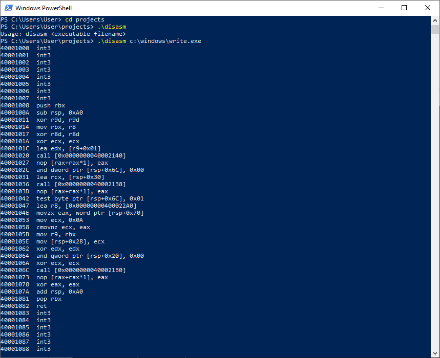
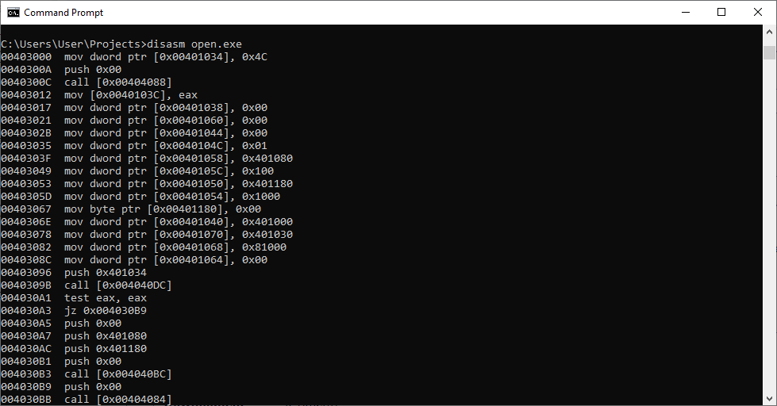
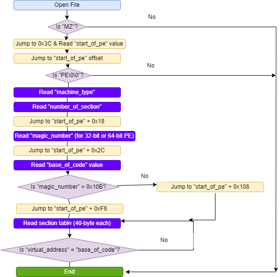

# disasm
A simple disassembler (based on Zydis 4) with my own PE parser

This is an update to the [https://github.com/exedumper/disasm](https://github.com/exedumper/disasm), now v0.04.

I moved the uninitialized data declaration the the end of data section, so EXE size reduced from over 640KB to 3KB.

## Prerequisite

I gave up studying decoding of CPU opcode, instead, I rely on [Zydis](https://github.com/zyantific/zydis) engine (x86 Zydis.dll) to do simple disassembly.

No code flow analysis, anything in code section will be disassembled regardless of data or code.

## Disadvantages

The disadvantages of my `disasm.ASM`:
- No 64-bit virtual memory address even for 64-bit PE (only 32-bit Image Base and virtual address)
- Cannot read more than one executable code section
- May stop disassembling half way if code section mix with data bytes
- Disassemble from start to end of first code section, not from entry point
- No support for tiny PE

## Screenshots





## Usage

`disasm file.exe > file.txt` 

(To redirect output to text file, either using `>` to create new text file or `>>` to append to existing text file)

## How this program parse PE file

This is the supplementary note for the PE parser (used in `disasm.ASM`), the diagram I drew is ugly.

This is how I parse EXE/DLL file for code section by matching the `VirtualAddress` with `BaseOfCode`.

But from other disassembler source code I found, there is a more reliable way to tell which section is code section.

The section flags in the Characteristics field of the section header indicate characteristics of the section:

```
IMAGE_SCN_CNT_CODE
0x00000020
The section contains executable code.
```



## License

The Zydis.dll is licensed as MIT, but this `disasm.ASM` is CC0 (loyalty-free).
